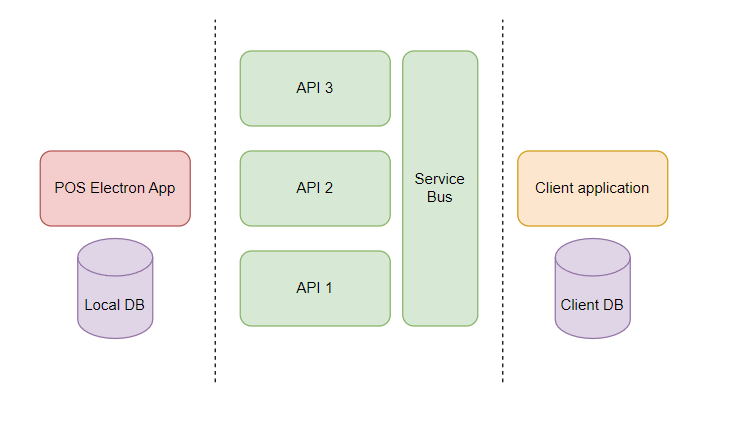

# The "Best Coders Club" (working company title) present "pos_sys"

## Introduction

This document describes the architectural systems and choices we propose to use for the development of the point-of-sale project.

This project aims to be an affordable, extensible and simple point of sale system for small businesses and merchants

## Principles

**Use of open source-first** - Prefer the use of open source, favouring reuse of proven frameworks, patterns and tools over build from scratch to save time and money.

**Automate first** - prefer to automate development tasks and maintenance tasks (over manual tasks)

**Code first** - define as much of the overall product using code as possible, this includes the application code, automated testing and all infrastructure.

**API first** - An API-first approach involves developing APIs that are consistent and reusable, which can be accomplished by using an API description language to establish a contract for how the API is supposed to behave.

## Architecture

## Key functional requirements

1) Offer ability to scan in or manually create new stock items and sync with client db
2) Sync a client database with a local database to display up to date stock data
3) Manual CRUD operations on local DB
4) ...
5) ...
n) ...

## Key non-functional requirements

1) The system must be easy to connect to via REST APIs
2) Must have awesome documentation
3) Must have top notch security, we are dealing with commercial enterprises after all
4) Must have scalability
5) Must be performant on all platforms
n) ...

## Inter-connectvity

Digging into the APIs

## Security

We have thought about it look here...

## Accessibility

A nice accessible user interface

## Peformance management and caching

How will we keep the app / apis performant?

## Hosting arrangments

How will we ship this?

